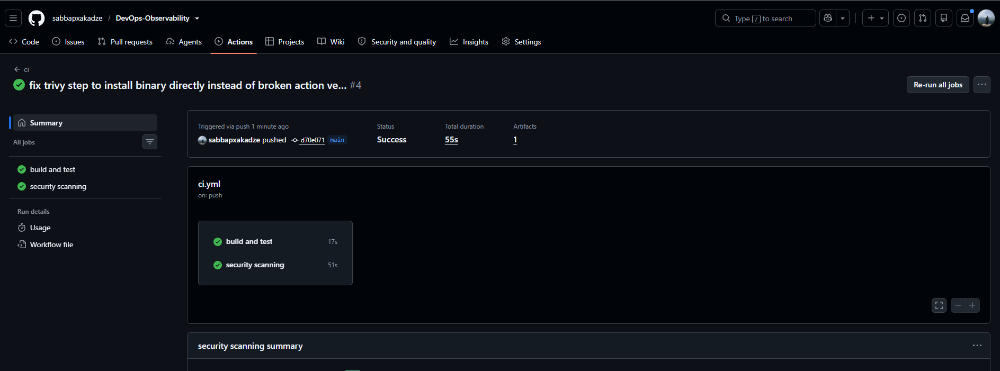
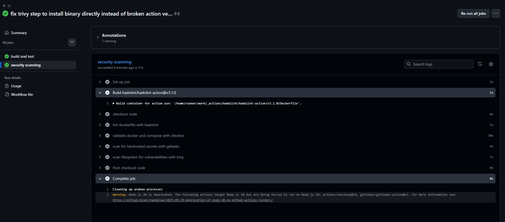

# DevOps Observability Lab — Final Project

A production-ready observability stack for a containerized Node.js application.
Covers metrics, logging, alerting, CI/CD, security scanning, health checks, and automated reliability tooling — deployable with a single command.

---

## Table of Contents

1. [Architecture](#architecture)
2. [Quick Start](#quick-start)
3. [CI/CD Pipeline](#cicd-pipeline)
4. [Security Implementation](#security-implementation)
5. [Reliability Improvements](#reliability-improvements)
6. [Monitoring and Logging](#monitoring-and-logging)
7. [Alerting](#alerting)
8. [Scripts Reference](#scripts-reference)
9. [Branching Strategy](#branching-strategy)
10. [Screenshots](#screenshots)

---

## Architecture

```
┌─────────────────────────────────────────────────────────────────────┐
│                    Docker Network (observability)                    │
│                                                                      │
│  ┌──────────────────┐  scrape /metrics  ┌───────────────────────┐  │
│  │   Node.js App    │◄──────────────────│      Prometheus       │  │
│  │   (port 3000)    │                   │      (port 9090)      │  │
│  │                  │                   └───────────┬───────────┘  │
│  │  GET /           │                               │ metrics data  │
│  │  GET /error      │               ┌───────────────▼───────────┐  │
│  │  GET /metrics    │◄── browser    │         Grafana           │  │
│  └────────┬─────────┘               │        (port 3001)        │  │
│           │ stdout + file (volume)  └───────────────────────────┘  │
│           ▼                                       ▲                 │
│  ┌──────────────────┐  tail logs  ┌──────────────┴────────────┐   │
│  │   app-logs       │◄────────────│         Promtail          │   │
│  │  Docker Volume   │             └──────────────┬────────────┘   │
│  └──────────────────┘                            │ push to Loki    │
│                                   ┌──────────────▼────────────┐   │
│                                   │           Loki            │   │
│                                   │        (port 3100)        │   │
│                                   └───────────────────────────┘   │
└─────────────────────────────────────────────────────────────────────┘
```

### Services

| Service | Port | Role |
|---|---|---|
| Node.js App | 3000 | HTTP API + Prometheus metrics endpoint |
| Prometheus | 9090 | Metrics collection, alerting engine |
| Loki | 3100 | Log aggregation |
| Promtail | internal | Log shipper (tails file → pushes to Loki) |
| Grafana | 3001 | Dashboards, log explorer, alert UI |

All services share a Docker bridge network (`observability`) and persist data in named volumes.

---

## Quick Start

### Prerequisites
- Docker Desktop (includes Docker Compose)

### Linux / macOS
```bash
bash setup.sh
```

### Windows (PowerShell)
```powershell
.\setup.ps1
```

Both scripts:
1. Check that Docker is installed and running
2. Copy `.env.example` → `.env` (if not already present)
3. Run `docker compose up --build -d`
4. Wait 45 seconds for services to become healthy
5. Run `scripts/verify-deployment.sh` / `.ps1` to confirm all endpoints respond

After setup, access:

| Service | URL | Credentials |
|---|---|---|
| App | http://localhost:3000 | — |
| Grafana | http://localhost:3001 | admin / admin |
| Prometheus | http://localhost:9090 | — |
| Loki API | http://localhost:3100 | — |

### Manual start (alternative)
```bash
docker compose up --build -d
```

---

## CI/CD Pipeline

The pipeline is defined in `.github/workflows/ci.yml` and runs on every push to any branch and on pull requests to `main`.

### Jobs

#### `test` — Build and Test
| Step | Tool | Purpose |
|---|---|---|
| install | npm | install production + dev dependencies |
| audit | npm audit | fail if any **high** or **critical** CVEs in dependencies |
| lint | ESLint | enforce `eslint:recommended` code quality rules |
| test | node --test | run unit/integration tests via Node.js built-in test runner |

#### `security` — Security Scanning
| Step | Tool | Purpose |
|---|---|---|
| dockerfile lint | Hadolint | fail on Dockerfile best-practice errors |
| IaC validation | Checkov | scan `docker-compose.yml` and `Dockerfile` for misconfigurations |
| secrets scan | Gitleaks | scan entire git history for hardcoded secrets or credentials |
| image/fs scan | Trivy | scan `./app` filesystem for HIGH/CRITICAL CVEs (report only) |

Both jobs run in parallel. A push only fully passes when both jobs are green.

---

## Security Implementation

### Dependency Vulnerability Scanning
`npm audit --audit-level=high` runs on every CI push. The build fails if any dependency has a known HIGH or CRITICAL CVE. Fix by running `npm audit fix` locally.

### Dockerfile Linting (Hadolint)
Hadolint checks the `app/Dockerfile` against Docker best practices on every CI run. Configured to fail on **error**-level findings only (warnings are informational).

### Infrastructure as Code Scanning (Checkov)
Checkov validates both `docker-compose.yml` and `app/Dockerfile` against security policies (CIS benchmarks, misconfigurations). Runs in soft-fail mode — findings are reported in CI logs without blocking the build, allowing incremental remediation.

### Secrets Scanning (Gitleaks)
Gitleaks scans the full git commit history for patterns matching API keys, tokens, passwords, and private keys. Runs in CI on every push. To scan locally:
```bash
docker run --rm -v "$(pwd):/repo" zricethezav/gitleaks:latest detect --source /repo
```

### Container Filesystem Scanning (Trivy)
Trivy scans the `./app` directory for known CVEs in OS packages and language dependencies. Results are printed to the CI log. Exit code is set to `0` (report-only) since `npm audit` already gates the build on HIGH/CRITICAL findings.

### Secrets Management
Credentials are never committed to the repository. `.env` is listed in `.gitignore`. Use `.env.example` as a template:
```bash
cp .env.example .env
# edit .env with your values
```

---

## Reliability Improvements

### Docker Health Checks
Every service in `docker-compose.yml` has a `healthcheck` block that polls its HTTP health endpoint:

| Service | Health endpoint | Interval |
|---|---|---|
| app | `GET /` | 30s |
| prometheus | `GET /-/healthy` | 30s |
| loki | `GET /ready` | 30s |
| promtail | `GET /ready` (port 9080) | 30s |
| grafana | `GET /api/health` | 30s |

`depends_on` for `promtail` and `grafana` use `condition: service_healthy`, so they only start after their upstream services pass health checks.

The `app/Dockerfile` also includes a `HEALTHCHECK` instruction so `docker ps` reports health state directly.

### Rollback Procedure
To roll back the app to its previous git commit:
```bash
bash scripts/rollback.sh        # Linux/Mac
powershell scripts/rollback.ps1 # Windows
```
The script shows the current and previous commit, asks for confirmation, stops the stack, checks out the previous app code, and rebuilds.

### Incident Response
See [`docs/incident-runbook.md`](docs/incident-runbook.md) for playbooks covering:
- HighErrorRate alert (including rollback steps)
- ServiceDown alert
- HighRequestRate alert
- General recovery procedures (restart single service, full restart, full reset)

### Service Availability Objectives

| Service | Target | Max Downtime/Month |
|---|---|---|
| App | 99% | ~7 hours |
| Prometheus | 99% | ~7 hours |
| Grafana | 95% | ~36 hours |
| Loki | 95% | ~36 hours |

---

## Monitoring and Logging

### Metrics (Prometheus)
Prometheus scrapes the app's `/metrics` endpoint every 15 seconds. Metrics exposed:

| Metric | Type | Description |
|---|---|---|
| `app_requests_total` | Counter | Total HTTP requests received |
| `app_errors_total` | Counter | Total 500 responses returned |

Query examples in Prometheus / Grafana:
```promql
rate(app_requests_total[1m]) * 60   # requests per minute
rate(app_errors_total[1m]) * 60     # errors per minute
```

### Logging (Loki + Promtail)
The app writes every request as a single-line JSON log to both stdout and `/app/logs/app.log` (a shared Docker named volume). Promtail tails this file, parses the JSON, and promotes `level` and `endpoint` fields to indexed Loki labels.

**Log schema:**
```json
{"timestamp":"2026-06-27T10:00:00Z","level":"info","message":"Request received","endpoint":"/","method":"GET","status":200}
```

**Filter in Grafana Explore (Loki):**
```logql
{service="app", level="error"}
{service="app", endpoint="/error"}
```

### Grafana Dashboard
Auto-provisioned dashboard "Application Observability" with 6 panels:
- Total Requests (counter stat)
- Total Errors (counter stat, goes red at ≥1)
- Error Rate per minute (stat with thresholds: green <3, orange 3–5, red >5)
- Request Rate per second (stat)
- Requests Over Time (timeseries, 30-min window)
- Error Rate Over Time (timeseries with alert threshold line at 5/min)

---

## Alerting

### Alert Rules

Three Prometheus alert rules defined in `prometheus/alerts.yml`:

| Alert | Severity | Condition | For |
|---|---|---|---|
| HighErrorRate | critical | `rate(app_errors_total[1m]) * 60 > 5` | immediate |
| HighRequestRate | warning | `rate(app_requests_total[1m]) * 60 > 100` | 2 minutes |
| ServiceDown | critical | `up == 0` | 1 minute |

Grafana Unified Alerting also provisions a `CRITICAL - High Error Rate` rule that mirrors the HighErrorRate condition and is visible in the Grafana Alerting UI.

### How to trigger HighErrorRate

```powershell
# Windows — send 20 errors in rapid succession
for ($i = 0; $i -lt 20; $i++) {
    Invoke-WebRequest -Uri http://localhost:3000/error -UseBasicParsing | Out-Null
}
```
```bash
# Linux/Mac
for i in {1..20}; do curl -s http://localhost:3000/error > /dev/null; done
```

Then open **Grafana → Alerting → Alert Rules** — the rule changes to **Firing** within ~30 seconds.
Check Prometheus at http://localhost:9090/alerts for the native rule state.

---

## Scripts Reference

| Script | Platform | Purpose |
|---|---|---|
| `setup.sh` | Linux/Mac | Full one-command setup |
| `setup.ps1` | Windows | Full one-command setup |
| `scripts/verify-deployment.sh` | Linux/Mac | Ping all service endpoints, exit 1 on failure |
| `scripts/verify-deployment.ps1` | Windows | Same |
| `scripts/rollback.sh` | Linux/Mac | Roll back app to previous git commit |
| `scripts/rollback.ps1` | Windows | Same |

---

## Branching Strategy

This project follows a simplified **GitHub Flow**:

- `main` — always deployable; protected; only receives merges via pull request
- `feature/<name>` — short-lived branches for individual features or fixes
- `hotfix/<name>` — urgent fixes that go straight to a PR against `main`

All PRs must pass the full CI pipeline (both `test` and `security` jobs) before merging.

---

## Screenshots

### Grafana Dashboard — Application Metrics


### Grafana Explore — Filtered JSON Logs (Loki)


### Grafana Alerting — Active Alert Rule


### CI Pipeline — GitHub Actions (test job)


### Security Scanning — GitHub Actions (security job)

