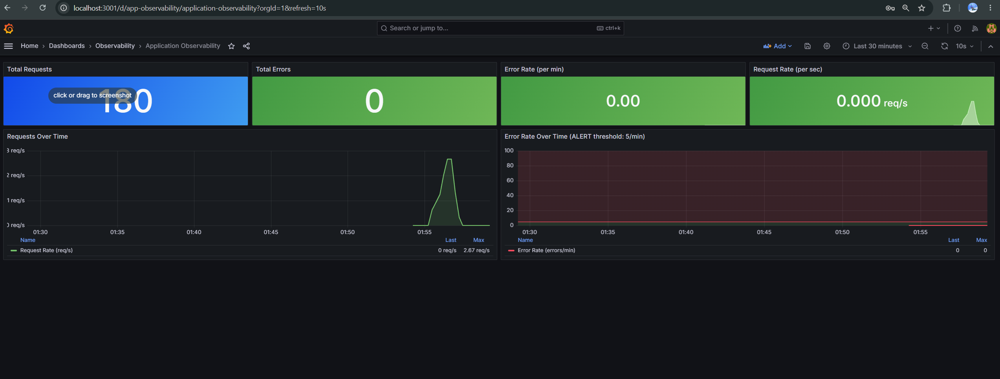
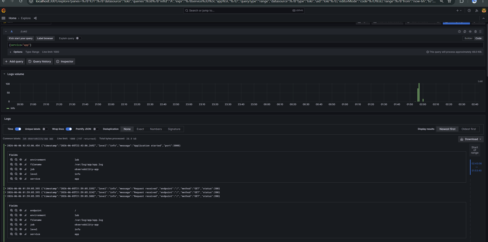

# DevOps Observability Lab

A complete observability stack for a containerized Node.js application, featuring metrics collection, log aggregation, visualization, and automated alerting — deployable with a single command.

## Architecture Diagram

```
┌─────────────────────────────────────────────────────────────────────┐
│                    Docker Network (observability)                    │
│                                                                      │
│  ┌──────────────────┐  scrape /metrics  ┌───────────────────────┐  │
│  │   Node.js App    │◄──────────────────│      Prometheus       │  │
│  │   (port 3000)    │                   │      (port 9090)      │  │
│  │                  │                   └───────────┬───────────┘  │
│  │  GET /           │                               │ metrics data  │
│  │  GET /error      │               ┌───────────────▼───────────┐  │
│  │  GET /metrics    │◄── browser    │         Grafana           │  │
│  └────────┬─────────┘               │        (port 3001)        │  │
│           │ stdout + file (volume)  └───────────────────────────┘  │
│           ▼                                       ▲                 │
│  ┌──────────────────┐  tail logs  ┌──────────────┴────────────┐   │
│  │   app-logs       │◄────────────│         Promtail          │   │
│  │  Docker Volume   │             └──────────────┬────────────┘   │
│  └──────────────────┘                            │ push to Loki    │
│                                   ┌──────────────▼────────────┐   │
│                                   │           Loki            │   │
│                                   │        (port 3100)        │   │
│                                   └───────────────────────────┘   │
└─────────────────────────────────────────────────────────────────────┘

Data Flow:
  Metrics → App exposes /metrics → Prometheus pulls every 15s → Grafana queries
  Logs    → App writes JSON to volume → Promtail tails → pushes to Loki → Grafana Explore
  Alerts  → Prometheus evaluates rules every 30s → Grafana Alerting displays state
```

## Quick Start

```bash
docker compose up --build -d
```

Wait ~30 seconds for all services to start, then access:

| Service    | URL                       | Credentials  |
|------------|---------------------------|--------------|
| App        | http://localhost:3000     | —            |
| Grafana    | http://localhost:3001     | admin / admin|
| Prometheus | http://localhost:9090     | —            |
| Loki API   | http://localhost:3100     | —            |

> **Note:** If the Grafana alert rule shows an error on first boot, run `docker compose restart grafana` — this ensures the "Observability" folder is created before the alert rule is registered.

## Implementation Details

### Logging Strategy

This lab uses **structured JSON logging** via the **Loki + Promtail** stack:

- The Node.js app writes every log entry as a single-line JSON object to both **stdout** and a file inside a shared Docker named volume (`app-logs` → `/app/logs/app.log`).
- **Promtail** mounts the same volume read-only, tails `*.log` files, and ships each line to Loki. A pipeline stage parses the JSON and promotes `level` and `endpoint` fields to indexed Loki labels.
- **Loki** stores the raw log strings compressed on disk, indexed only by labels — keeping storage costs low while keeping queries fast.
- **Grafana Explore** (Loki data source) allows filtered queries like `{service="app", level="error"}` in real time.

The file-based approach (vs Docker socket) makes the setup fully cross-platform (Linux, macOS, Windows Docker Desktop).

### How to Trigger the CRITICAL Alert

The alert fires when the app error rate exceeds **5 errors per minute**.

**Step 1 — Verify stack is running:**
```bash
docker compose ps
```

**Step 2 — Send a burst of errors:**

PowerShell:
```powershell
for ($i = 0; $i -lt 20; $i++) {
    Invoke-WebRequest -Uri http://localhost:3000/error -UseBasicParsing | Out-Null
}
```

Bash / Git Bash:
```bash
for i in {1..20}; do curl -s http://localhost:3000/error > /dev/null; done
```

**Step 3 — Watch the alert fire:**
- Open Grafana → **Alerting → Alert Rules** → "CRITICAL - High Error Rate" changes to **Firing**
- Confirm in Prometheus: http://localhost:9090/alerts

**Step 4 — Stop triggering and watch it resolve:**
- Stop sending errors; after ~1 minute the alert returns to **Normal**

---

## Evidence Screenshots

> Replace the placeholders below with your actual screenshots after triggering the alert.

### 1. Grafana Dashboard — Custom Application Metrics


### 2. Grafana Explore — Filtered JSON Logs (Loki)


### 3. Grafana Alerting Tab — Active Alert Rule


---

## Analysis

### 1. Why is JSON-structured logging more efficient than plain text logs?

JSON-structured logging stores each log entry as a machine-parseable key-value document rather than a free-form string. This means log aggregators (Loki, Elasticsearch) can index specific fields like `level`, `endpoint`, or `timestamp` without expensive regex parsing at query time. Filtering becomes an exact label match (`level="error"`) rather than a costly string scan, which is both faster and more reliable at scale. It also enables rich, type-aware filtering in tools like Grafana's Explore view with zero extra configuration.

### 2. What is the fundamental technical difference between Prometheus (metrics) and Loki (logging)?

**Prometheus** is a time-series database that **pulls** numeric samples from targets on a fixed interval. Each sample is a single float64 value with a timestamp and a label set. It stores only the number — no free text, no context. It is optimized for mathematical aggregation (`rate()`, `histogram_quantile()`) and threshold-based alerting.

**Loki** is a log aggregation system that **receives pushed** text events in arbitrary order. It indexes only the labels attached to a log stream (not the log line content), storing the raw text compressed in chunks. It is optimized for full-text search and event correlation over time.

The two are **complementary**: Prometheus tells you *that* something is wrong (e.g., error rate > 5/min), and Loki tells you *why* (e.g., `NullPointerException` in the stack trace at that exact timestamp).

### 3. How would you handle long-term log retention (6 months) without depleting disk resources?

Three complementary strategies:

1. **Retention policies** — Configure Loki's compactor with `retention_enabled: true` and `retention_period: 4320h` (180 days). The compactor automatically garbage-collects chunks older than the retention window on a scheduled basis, keeping disk usage bounded.

2. **Tiered object storage** — Replace Loki's local filesystem backend with an S3-compatible store (AWS S3, GCS, MinIO). Move chunks older than 7 days to object storage automatically. Cloud object storage costs 10–20× less per GB than local SSDs and scales without manual intervention.

3. **Log volume reduction** — Avoid logging every request at `DEBUG` level in production. Use `INFO`/`WARN` for steady-state operations, rely on Prometheus counters for per-request metrics (not log lines), and configure Promtail pipeline `drop` stages to discard high-frequency low-value entries (e.g., health-check pings) before they reach Loki.

---

## Publishing to GitHub

```bash
# In the project folder:
git init
git add .
git commit -m "feat: complete observability lab — Prometheus, Loki, Grafana, Node.js app"

# Create a new empty repo on GitHub (no README), then:
git remote add origin https://github.com/YOUR_USERNAME/devops-observability-lab.git
git branch -M main
git push -u origin main
```

After pushing, add your screenshots to the `screenshots/` folder and commit them:
```bash
git add screenshots/
git commit -m "docs: add evidence screenshots"
git push
```
